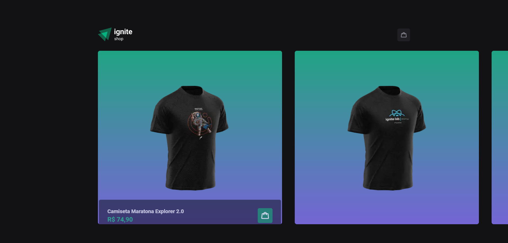

  

# 🛒 Ignite Shop 🛒

Ignite Shop foi criado para resolução do 4º desafio da formação React da @Rocketseat. É um projeto de um E-Commerce feito com Next para aprimorar o meu desenvolvimento com o proprio Next (SSR/SSG), também foi utilizado o Stripe (o Stripe é uma infraestrutura de produtos pagamentos para a internet) para realizar o pagamento do pedido criando uma rota dentro de pages, para a estilização do projeto foi usado o Stitches.

Neste projeto foi aplicado diversos conhecimentos visto no módulo como: Context API, layout default, rotas, formulários com React-Hook-Form, hooks (useState e useEffect), além dos fundamentos básicos da ferramenta como a componentização.

O Projeto também foi desenvolvido do total zero, seguindo o layout do Figma, seguindo arrisca todos os parâmetros de cores, tamanho das fontes, espaçamento e estados em que cada elemento possa assumir na aplicação, além de, ter sido incluído alguns elementos a mais a fim de enriquecer o projeto.

- Veja o projeto: [Preview]()

## ⚙️ Funcionalidades

- [x] Carrossel de produtos na página principal;
- [x] Página de detalhes do produto, sendo possível finalizar a compra;
- [x] Página de compra realizada com sucesso, mostrando os produtos comprados ao final;
- [x] Carrinho dialog lateral com as funcinalidades;
- [x] Implementa cabeçalhos diferentes entre páginas;
- [x] Exibir o total de itens no carrinho no Header;
- [x] Exibir o valor total da soma de itens no carrinho multiplicados pelo valor;

## 💳 Alguns cartões para simular pagamentos no checkout

| Marca | Número | CVC | Data | Opção |
| --- | --- | --- | --- | --- |
| Visa | `4242 4242 4242 4242` | Quaisquer 3 dígitos | Qualquer data futura | SUCESSO |
| Martercard | `5555 5555 5555 4444` | Quaisquer 3 dígitos | Qualquer data futura | SUCESSO |
| Visa | `4000 0000 0000 9995` | Quaisquer 3 dígitos | Qualquer data futura | CARTÃO RECUSADO POR FUNDOS INSUFICIENTES |
| Visa | `4000 0000 0000 0127` | Quaisquer 3 dígitos | Qualquer data futura | CARTÃO RECUSADO POR CVC INCORRETO |

> Para outros cenários de teste consulte a documentação do Stripe

## 🚀 Tecnologias

- [x] [React](https://reactjs.org/)
- [x] [Next.js](https://nextjs.org/)
- [x] [TypeScript](https://www.typescriptlang.org/)
- [x] [Stitches](https://stitches.dev/)
- [x] [Radix](https://www.radix-ui.com/primitives/docs/components/dialog)
- [x] [Axios](https://axios-http.com/ptbr/docs/intro)
- [x] [Phosphor Icons](https://phosphoricons.com/)
